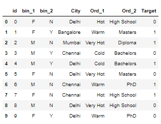
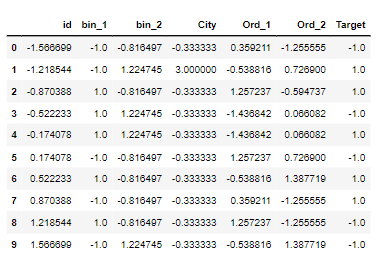
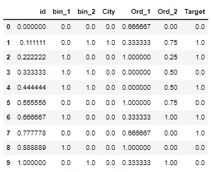
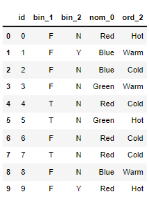
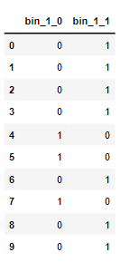
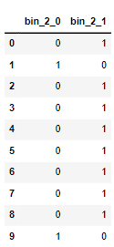
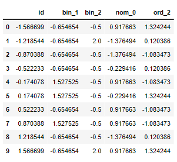
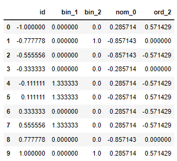
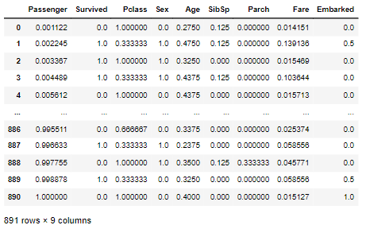
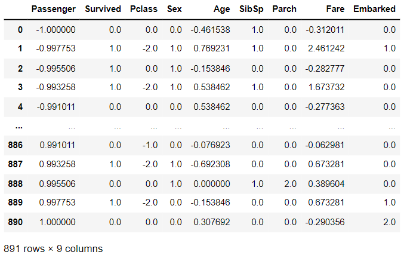

# EX-05-Feature-Generation

## AIM
To read the given data and perform Feature Generation process and save the data to a file. 

# Explanation
Feature Generation (also known as feature construction, feature extraction or feature engineering) is the process of transforming features into new features that better relate to the target.

# FEATURE ENCODING:
Ordinal Encoding An ordinal encoding involves mapping each unique label to an integer value. This type of encoding is really only appropriate if there is a known relationship between the categories. This relationship does exist for some of the variables in our dataset, and ideally, this should be harnessed when preparing the data.

Label Encoding Label encoding is a simple and straight forward approach. This converts each value in a categorical column into a numerical value. Each value in a categorical column is called Label.

Binary Encoding Binary encoding converts a category into binary digits. Each binary digit creates one feature column. If there are n unique categories, then binary encoding results in the only log(base 2)ⁿ features.

One Hot Encoding We use this categorical data encoding technique when the features are nominal(do not have any order). In one hot encoding, for each level of a categorical feature, we create a new variable. Each category is mapped with a binary variable containing either 0 or 1. Here, 0 represents the absence, and 1 represents the presence of that category.

# FEATURE SCALING
Standard Scaler It is also called Z-score normalization. It calculates the z-score of each value and replaces the value with the calculated Z-score. The features are then rescaled with x̄ =0 and σ=1

MinMaxScaler It is also referred to as Normalization. The features are scaled between 0 and 1. Here, the mean value remains same as in Standardization, that is, 0.

Maximum absolute scaling Maximum absolute scaling scales the data to its maximum value; that is, it divides every observation by the maximum value of the variable.The result of the preceding transformation is a distribution in which the values vary approximately within the range of -1 to 1.

RobustScaler RobustScaler transforms the feature vector by subtracting the median and then dividing by the interquartile range (75% value — 25% value).

# ALGORITHM
### STEP 1
Read the given Data
### STEP 2
Clean the Data Set using Data Cleaning Process
### STEP 3
Apply Feature Generation techniques to all the feature of the data set
### STEP 4
Save the data to the file

# CODE
Data.csv :
~~~

import pandas as pd
df=pd.read_csv("data.csv")
df

#feature generation
import category_encoders as ce
be=ce.BinaryEncoder()
ndf=be.fit_transform(df["bin_1"])
df["bin_1"] = be.fit_transform(df["bin_1"])
ndf

ndf2=be.fit_transform(df["bin_2"])
df["bin_2"] = be.fit_transform(df["bin_2"])
ndf2

df1=df.copy()
from sklearn.preprocessing import LabelEncoder,OrdinalEncoder,OneHotEncoder
import category_encoders as ce
be=ce.BinaryEncoder()
ohe=OneHotEncoder(sparse=False)
le=LabelEncoder()
oe=OrdinalEncoder()

df1["City"] = ohe.fit_transform(df1[["City"]])

temp=['Cold','Warm','Hot','Very Hot']
oe1=OrdinalEncoder(categories=[temp])
df1['Ord_1'] = oe1.fit_transform(df1[["Ord_1"]])

edu=['High School','Diploma','Bachelors','Masters','PhD']
oe2=OrdinalEncoder(categories=[edu])
df1['Ord_2']= oe2.fit_transform(df1[["Ord_2"]])
df1

#feature scaling
from sklearn.preprocessing import MinMaxScaler
sc=MinMaxScaler()
df2=pd.DataFrame(sc.fit_transform(df1),columns=['id', 'bin_1', 'bin_2', 'City', 'Ord_1','Ord_2','Target'])
df2

from sklearn.preprocessing import StandardScaler
sc1=StandardScaler()
df3=pd.DataFrame(sc1.fit_transform(df1),columns=['id', 'bin_1', 'bin_2', 'City', 'Ord_1','Ord_2','Target'])
df3

from sklearn.preprocessing import MaxAbsScaler
sc2=MaxAbsScaler()
df4=pd.DataFrame(sc2.fit_transform(df1),columns=['id', 'bin_1', 'bin_2', 'City', 'Ord_1','Ord_2','Target'])
df4

from sklearn.preprocessing import RobustScaler
sc3=RobustScaler()
df5=pd.DataFrame(sc3.fit_transform(df1),columns=['id', 'bin_1', 'bin_2', 'City', 'Ord_1','Ord_2','Target'])
df5

~~~
Encoding.csv :
~~~

import pandas as pd
df=pd.read_csv("Encoding Data.csv")
df

#feature generation
import category_encoders as ce
be=ce.BinaryEncoder()
ndf=be.fit_transform(df["bin_1"])
df["bin_1"] = be.fit_transform(df["bin_1"])
ndf

ndf2=be.fit_transform(df["bin_2"])
df["bin_2"] = be.fit_transform(df["bin_2"])
ndf2

df1=df.copy()
from sklearn.preprocessing import LabelEncoder,OrdinalEncoder
le=LabelEncoder()
oe=OrdinalEncoder()

df1["nom_0"] = oe.fit_transform(df1[["nom_0"]])
temp=['Cold','Warm','Hot']
oe2=OrdinalEncoder(categories=[temp])
df1['ord_2'] = oe2.fit_transform(df1[['ord_2']])

df1

#feature scaling
from sklearn.preprocessing import MinMaxScaler
sc=MinMaxScaler()
df0=pd.DataFrame(sc.fit_transform(df1),columns=['id', 'bin_1', 'bin_2', 'nom_0','ord_2'])
df0

from sklearn.preprocessing import StandardScaler
sc1=StandardScaler()
df2=pd.DataFrame(sc1.fit_transform(df1),columns=['id', 'bin_1', 'bin_2', 'nom_0','ord_2'])
df2

from sklearn.preprocessing import MaxAbsScaler
sc2=MaxAbsScaler()
df3=pd.DataFrame(sc2.fit_transform(df1),columns=['id', 'bin_1', 'bin_2', 'nom_0','ord_2'])
df3

from sklearn.preprocessing import RobustScaler
sc3=RobustScaler()
df4=pd.DataFrame(sc3.fit_transform(df1),columns=['id', 'bin_1', 'bin_2', 'nom_0','ord_2'])
df4

~~~
Titanic.csv :
~~~

import pandas as pd
df=pd.read_csv("titanic_dataset.csv")
df

#removing unwanted data
df.drop("Name",axis=1,inplace=True)
df.drop("Ticket",axis=1,inplace=True)
df.drop("Cabin",axis=1,inplace=True)

#data cleaning
df.isnull().sum()

df["Age"]=df["Age"].fillna(df["Age"].median())
df["Embarked"]=df["Embarked"].fillna(df["Embarked"].mode()[0])

df.isnull().sum()

df

#feature encoding
from category_encoders import BinaryEncoder
be=BinaryEncoder()
df["Sex"]=be.fit_transform(df[["Sex"]])
ndf=be.fit_transform(df["Sex"])
ndf

df1=df.copy()
from sklearn.preprocessing import LabelEncoder, OrdinalEncoder
embark=['S','C','Q']
e1=OrdinalEncoder(categories=[embark])
df1['Embarked'] = e1.fit_transform(df[['Embarked']])
df1

#feature scaling
from sklearn.preprocessing import MinMaxScaler
sc=MinMaxScaler()
df2=pd.DataFrame(sc.fit_transform(df1),columns=['Passenger','Survived','Pclass','Sex','Age','SibSp','Parch','Fare','Embarked'])
df2

from sklearn.preprocessing import StandardScaler
sc1=StandardScaler()
df3=pd.DataFrame(sc1.fit_transform(df1),columns=['Passenger','Survived','Pclass','Sex','Age','SibSp','Parch','Fare','Embarked'])
df3

from sklearn.preprocessing import MaxAbsScaler
sc2=MaxAbsScaler()
df4=pd.DataFrame(sc2.fit_transform(df1),columns=['Passenger','Survived','Pclass','Sex','Age','SibSp','Parch','Fare','Embarked'])
df4

from sklearn.preprocessing import RobustScaler
sc3=RobustScaler()
df5=pd.DataFrame(sc3.fit_transform(df1),columns=['Passenger','Survived','Pclass','Sex','Age','SibSp','Parch','Fare','Embarked'])
df5

~~~
# OUPUT
### data.csv:

### Encoding.csv:

###  Titanic.csv :

# Result:
Feature Generation process and Feature Scaling process is applied to the given data frames sucessfully.